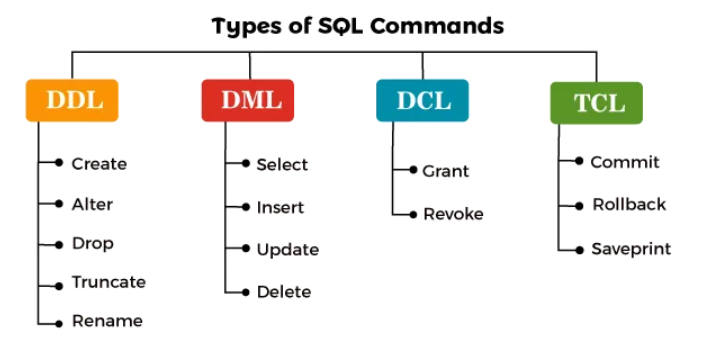

## Data Types and Constraints

---

### **Data Types**

- Define the kind of values stored in table columns to maintain data integrity and proper operations.
- **Categories:**
  1. **Numeric Types:** Store numbers (e.g., `BIGINT`, `INT`, `DECIMAL`).
  2. **Character Types:** Handle textual data (e.g., `CHAR`, `VARCHAR`, `TEXT`).
  3. **Date/Time Types:** Store date and time values (e.g., `DATE`, `DATETIME`).
  4. **Binary Types:** Store binary data (e.g., `BINARY`, `VARBINARY`).
  5. **Special Types:** Unique types like `ENUM`, `SET`, and `BLOB` for specific use cases.

---

### **Numeric Data Types**

- **Integer Types:** Store whole numbers (`BIGINT`, `INT`, `SMALLINT`, `TINYINT`).
- **Fixed-Point Types:** Exact numeric values (`DECIMAL`, `NUMERIC`).
- **Approximate Types:** Floating-point numbers (`FLOAT`, `REAL`).

---

### **Character Data Types**

- **CHAR:** Fixed-length non-Unicode characters.
- **VARCHAR:** Variable-length non-Unicode characters.
- **TEXT:** Large text storage.
- **NCHAR/NVARCHAR:** Unicode characters for multilingual support.

---

### **Date/Time Data Types**

- **DATE:** Store dates.
- **TIME:** Store time values.
- **DATETIME:** Store both date and time.

---

### **Binary Data Types**

- **BINARY/VARBINARY:** Store binary data, such as images or files.
- **BLOB:** Store large binary objects like multimedia content.

---

### **NULL Values**

- Represent missing or unknown data.
- Use Case: Fields without provided information (e.g., `Author: NULL`).

---

### **Special Data Types**

- **ENUM:** Restrict values to a predefined list (e.g., `Genre: ENUM('Fiction', 'Non-Fiction')`).
- **SET:** Allow multiple values from a predefined list (e.g., `Authors: SET('Author1', 'Author2')`).

---

### **Database Constraints**

- **PRIMARY KEY:** Uniquely identifies each record.
- **AUTO_INCREMENT:** Automatically generates unique values.
- **NOT NULL:** Ensures a column cannot contain null values.
- **UNIQUE:** Prevents duplicate values in a column.

---

### **Types of SQL Commands**

#### **1. Data Definition Language (DDL)**

- Defines and modifies database structures.
  - **CREATE:** Create tables or objects.
  - **ALTER:** Modify existing structures.
  - **DROP:** Permanently delete objects.
  - **TRUNCATE:** Remove all rows from a table but retain structure.
  - **RENAME:** Change object names.

#### **2. Data Manipulation Language (DML)**

- Manages data within tables.
  - **INSERT:** Add new records.
  - **UPDATE:** Modify existing records.
  - **DELETE:** Remove data.

#### **3. Data Control Language (DCL)**

- Controls access to data.
  - **GRANT:** Assign privileges to users.
  - **REVOKE:** Remove user privileges.

#### **4. Transaction Control Language (TCL)**

- Manages database transactions.
  - **COMMIT:** Save all changes.
  - **ROLLBACK:** Undo changes.
  - **SAVEPOINT:** Set rollback points in a transaction.

---

### **Choosing the Right Data Type**

- **Data Integrity:** Ensures data is stored in appropriate formats.
- **Storage Efficiency:** Optimize database space.
- **Performance:** Aligns data types with operational efficiency.
- **Future Growth:** Accommodates anticipated data size increases.
