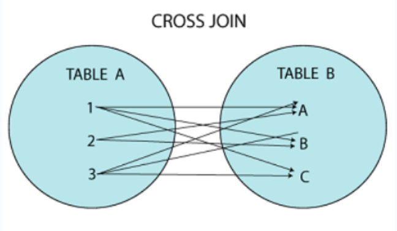

## Joins in SQL

---

### **Introduction to Joins**

- SQL Joins combine data from two or more tables in a relational database based on related columns.
- Commonly used for retrieving relevant records by comparing columns, often through primary and foreign keys.

---

### **Key Features of Joins**

- **Flexibility:** Combine tables in various ways based on structure and requirements.
- **Multiple Tables:** Query more than two tables simultaneously.
- **Comparison Operators:** Use equality or other operators for conditions.
- **No Storage:** Joins create a result set but don’t physically store data.

---

### **Types of Joins**

1. **Inner Join:** Combines records from tables where there is a match in both tables.


- Syntax:
  ```sql
  SELECT column_name(s)
  FROM table1
  INNER JOIN table2
  ON table1.column_name = table2.column_name;
  ```
- Example: Retrieve employees and their department names:
  ```sql
  SELECT Employees.EmployeeName, Departments.DepartmentName
  FROM Employees
  INNER JOIN Departments
  ON Employees.DepartmentID = Departments.DepartmentID;
  ```

2. **Left Join (Outer Join):** Returns all records from the left table and matched records from the right table; unmatched rows are filled with `NULL`.


- Syntax:
  ```sql
  SELECT column_name(s)
  FROM table1
  LEFT JOIN table2
  ON table1.column_name = table2.column_name;
  ```
- Example: Retrieve all employees and their department names:
  ```sql
  SELECT Employees.EmployeeName, Departments.DepartmentName
  FROM Employees
  LEFT JOIN Departments
  ON Employees.DepartmentID = Departments.DepartmentID;
  ```

3. **Right Join (Outer Join):** Returns all records from the right table and matched records from the left table; unmatched rows are filled with `NULL`.


- Syntax:
  ```sql
  SELECT column_name(s)
  FROM table1
  RIGHT JOIN table2
  ON table1.column_name = table2.column_name;
  ```

4. **Full Join:** Combines all records from both tables, with `NULL` for unmatched rows.


- MySQL doesn’t support `FULL JOIN` directly; emulate it with `LEFT JOIN` + `UNION` + `RIGHT JOIN`.

5. **Cross Join:** Produces a Cartesian product of two tables.

   - Syntax:
     ```sql
     SELECT column_name(s)
     FROM table1
     CROSS JOIN table2;
     ```

6. **Self Join:** A table is joined with itself to compare rows within the same table.



- Syntax:
  ```sql
  SELECT a.column1, b.column2
  FROM table1 a, table1 b
  WHERE a.common_field = b.common_field;
  ```

---

### **Joins with Additional Clauses**

1. **WHERE Clause:** Filters data after a join.

   - Example: Retrieve employees with a salary > 55,000:
     ```sql
     SELECT Employees.EmployeeName, Salaries.Salary
     FROM Employees
     INNER JOIN Salaries
     ON Employees.EmployeeID = Salaries.EmployeeID
     WHERE Salaries.Salary > 55000;
     ```

2. **ORDER BY Clause:** Sorts results after a join.
   - Example: Sort employees by department:
     ```sql
     SELECT Employees.EmployeeName, Departments.DepartmentName
     FROM Employees
     LEFT JOIN Departments
     ON Employees.DepartmentID = Departments.DepartmentID
     ORDER BY Departments.DepartmentName;
     ```

---

### **Advanced Join Operations**

1. **Delete with Join:** Remove records across multiple tables.

   - Example: Delete employees from a specific department:
     ```sql
     DELETE e
     FROM Employees e
     JOIN Departments d
     ON e.DepartmentID = d.DepartmentID
     WHERE d.DepartmentID = 3;
     ```

2. **Update with Join:** Update records across related tables.
   - Example: Increase salary by 10% for employees in IT:
     ```sql
     UPDATE Salaries s
     JOIN Employees e
     ON s.EmployeeID = e.EmployeeID
     SET s.Salary = s.Salary * 1.10
     WHERE e.DepartmentID = 2;
     ```

---

### **Practical Considerations**

- **Performance:** Avoid unnecessary joins; optimize with indexes.
- **Data Integrity:** Ensure relationships are well-defined.
- **NULL Handling:** Plan for missing data in outer joins.
- **Testing Queries:** Always test joins on a sample dataset to verify correctness.

This summary covers the essential types of SQL joins and their syntax, practical use cases, and examples for applying them effectively in database management.
